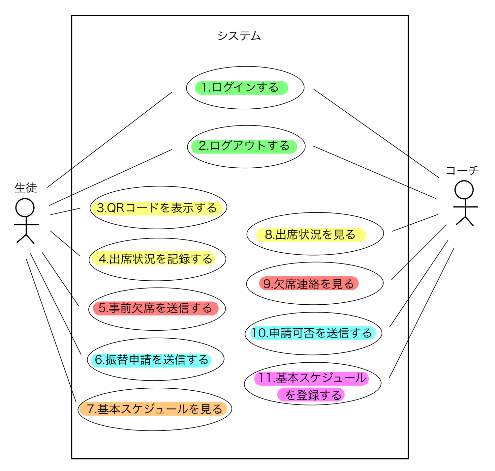
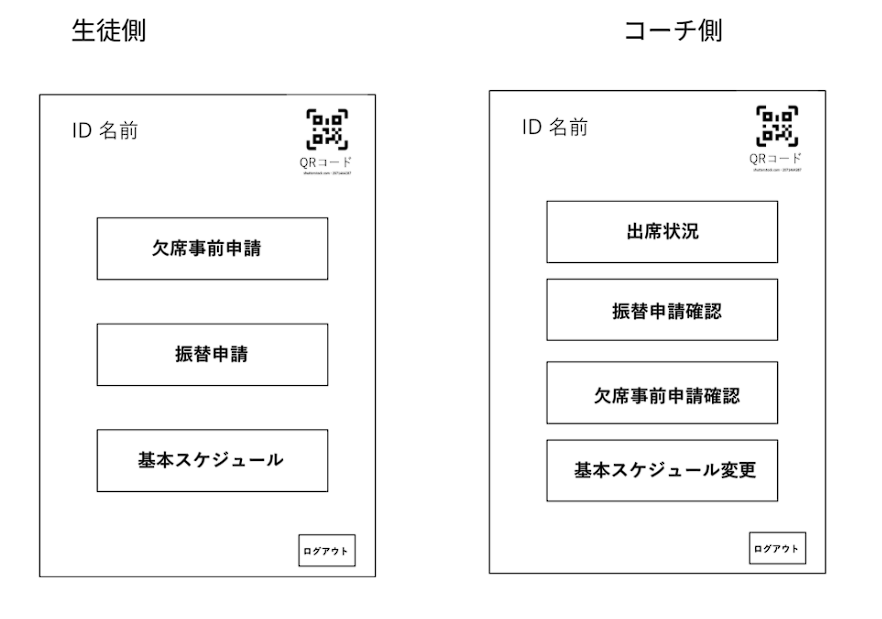

# システム　ユースケースモデリング

2025-06-23 Group1

システムのユースケースモデリングを行う．

## 1. ユースケース図

## 2. ユースケース一覧
### 2.1 生徒用ユースケース
1. [ログインする](./usecase01.md)
1. [ログアウトする](./usecase02.md)
1. [QRコードを表示する](./usecase03.md)
1. [出席状況を記録する](./usecase04.md)
1. [事前欠席を送信する](./usecase05.md)
1. [振替申請を送信する](./usecase06.md)
1. [基本スケジュールを見る](./usecase07.md)

### 2.2 管理者用ユースケース

1. [ログインする](./usecase01.md)
1. [ログアウトする](./usecase02.md)
1. [出席状況を見る](./usecase08.md)
1. [欠席連絡を見る](./usecase09.md)
1. [申請可否を送信する](./usecase10.md)
1. [基本スケジュールを登録する](./usecase11.md)

## ホーム画面
