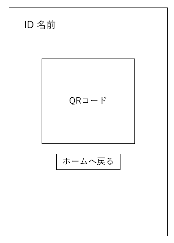

# ユースケース 03： QRコードを表示する

## 概要
生徒がログインに使用するQRコードを表示する

## アクター
- 生徒

## 事前条件
- システムに生徒としてログインしていること

## 事後条件
- ログインに用いるQRコードを表示する

## トリガ―
- ログイン後、QRコード表示ボタンを押下する

## 基本フロー
1. QRコードボタンを押下する
2. 生徒のIDごとに異なるQRコードを表示する

## 代替フロー
### 代替フロー1
- 2a.1  基本フロー2で生徒のIDが存在しない場合，システムはログインエラーを出し，1に戻る．
- 2a.2  基本フロー2でQRコードの表示に失敗した場合，システムはログインエラーを出し，1に戻る．

# GUI紙芝居
## 欠席申請フォーム画面
