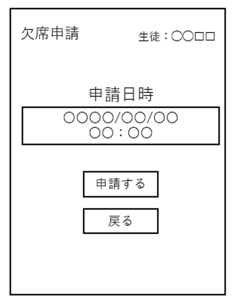

# ユースケース 05： 事前欠席を送信する
# 概要
- 生徒が出席情報を更新し、欠席に変更する．

# アクター
- 生徒
# 事前条件
- 生徒がシステムにログインしている
# 事後条件
- 生徒の出席情報が更新され、欠席に変更される．
# トリガ―
- 生徒が，「欠席を申請」ボタンを押す
# 基本フロー
1. 生徒が，「欠席を申請」ボタンを押す．
1. システムは，欠席申請フォーム画面を表示する．画面には年月日時の入力欄が表示される．
1. 生徒は，欠席を申請したいレッスンの年月日時を入力し，「申請」ボタンを押す．
1. システムは，入力された年月日時に，生徒が出席する予定になっているかチェックする．
1. チェックOKならば、システムは入力情報の確認画面を表示する．
1. 生徒は，OKボタンを押す．
1. システムは，入力された情報に基づいて，生徒の出席情報を更新し，欠席に変更する．欠席申請完了画面を表示する．

# 代替フロー
## 代替フロー1
4a.1 基本フロー4において，生徒が出席する予定になっていない場合は，エラー「そのレッスンは出席予定ではありません」を表示し，2に戻る．
## 代替フロー2
6a.1 基本フロー6において，欠席申請を取りやめたい場合には，「戻る」ボタンを押す．2に戻る．

# GUI紙芝居
## 欠席申請フォーム画面
