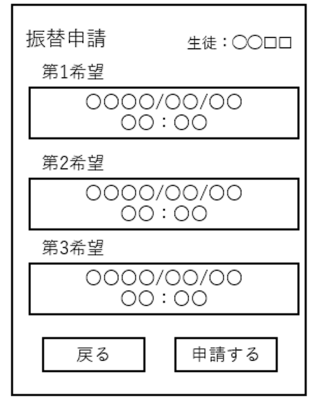

# ユースケース 08： 出席状況を見る

## 概要
コーチが生徒から送信された出席状況を閲覧する

## アクター
- コーチ

## 事前条件
- システムにコーチとしてログインしていること

## 事後条件
- 生徒の出席状況を閲覧する

## トリガ―
- ログイン後、出席状況ボタンを押下する

## 基本フロー
出席状況ボタンを押下する
ユースケース3で送信された生徒情報と出席情報を一覧で表示する。この時、過去1か月までを表示し、それ以前のデータは削除される。

## 代替フロー
### 代替フロー1
- 2a.1  基本フロー2で情報の取得に失敗した場合，システムはログインエラーを出し，1に戻る．

# GUI紙芝居
## 欠席申請フォーム画面
