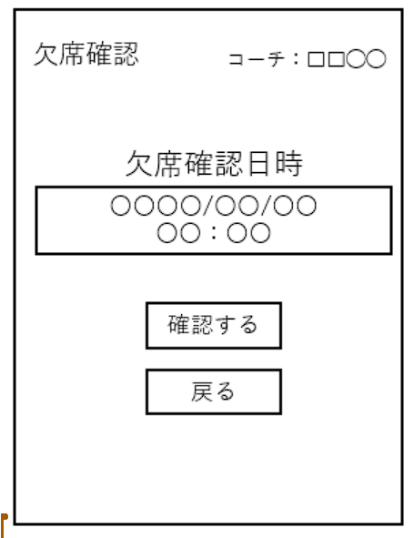

# ユースケース 09： 欠席申請を確認する
# 概要
- コーチが生徒の欠席情報を確認する．

# アクター
- コーチ
# 事前条件
- コーチがシステムにログインしている
# 事後条件
- コーチが生徒の欠席情報を確認できる．
# トリガ―
- コーチが，各画面から「欠席を確認」ボタンを押す.
# 基本フロー
1. コーチが，各画面から「欠席を確認」ボタンを押す．
1. システムは，欠席確認フォーム画面を表示する．画面には年月日時の入力欄が表示される．
1. コーチは，欠席確認フォーム画面に、確認したいレッスンの年月日時を入力し，「確認」ボタンを押す．
1. システムは，入力された年月日時に，出席情報が欠席になっている生徒の存在をチェックする．
1. チェックOKならば、システムは出席情報が欠席になっている生徒の一覧を表示する．

# 代替フロー
## 代替フロー1
4a.1 基本フロー4において，出席情報が欠席になっている生徒がいない場合は，メッセージ「現在、欠席予定の生徒はいません」を表示する．

# GUI紙芝居
## 欠席確認フォーム画面

